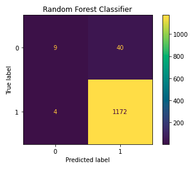

# White and Red Wine Quality
### GoogleSlides: https://docs.google.com/presentation/d/1lBkx4nlX7K-AxiD_H6Ej8JHxEf8ZiycRnW8QxpIP6WQ/edit#slide=id.g124a9435f49_0_82

### Tableaupublic: https://public.tableau.com/app/profile/ashley.gaddis2595/viz/WineQuality_16501284766880/ImportantAttributestoDetermineWineQuality3

-----------------------------------------------------------------------------------

# Backgroud

>The two datasets are related to red and white variants of the Portuguese "Vinho Verde" wine.
>For more details, consult: http://www.vinhoverde.pt/en/ or the reference [Cortez et al., 2009].
>Due to privacy and logistic issues, only physicochemical (inputs) and sensory (the output) variables
>are available (e.g. there is no data about grape types, wine brand, wine selling price, etc.).

>These datasets can be viewed as classification or regression tasks.
>The classes are ordered and not balanced (e.g. there are munch more normal wines than
>excellent or poor ones). Outlier detection algorithms could be used to detect the few excellent
>or poor wines. Also, we are not sure if all input variables are relevant. So
>it could be interesting to test feature selection methods.

## Reason the topic was selected
The Global Market value of Wine has reached over $340 billion dollars and continue to grow. If we can determine which elements have the greatest impact on the quality of wine, we can provide a good indication on how the wine will sale and improve quality assurance. Also, wine is delicious and a staple in any household.

-------------------------------------------------------------------------------------------------------
## Description of the source of data
The data was downloaded from Kaggle: https://www.kaggle.com/datasets/danielpanizzo/wine-quality
It came as a two CSV file White Wine with 4899 rows and 12 columns and Red Wine with 1600 rows and 12 columns.

*Columns*
Input variables (based on physicochemical tests):

1. fixed acidity (tartaric acid - g / dm^3)
2. volatile acidity (acetic acid - g / dm^3)
3. citric acid (g / dm^3)
4. residual sugar (g / dm^3)
5. chlorides (sodium chloride - g / dm^3
6. free sulfur dioxide (mg / dm^3)
7. total sulfur dioxide (mg / dm^3)
8. density (g / cm^3)
9. pH
10. sulphates (potassium sulphate - g / dm3)
11. alcohol (% by volume)
*Output variable (based on sensory data):*
12. quality (score between 0 and 10)
-----------------------------------------------------------------------------------------------------
## Technologies Used 
- Slack and Zoom - main communication tool
- Python/Pandas - ETL ,matplotlib, sklearn
- Jupyter lab - run notebooks
- Github - to host data and facilitate communication and collaboration between team members.
- PostgreSQL - to create the Database on AWS.
- Tableau - to display and visualize the data.
- GoogleSlides- for display and presentation tool.

## Data Cleaning and Analysis
Pandas will be used to clean the data and perform an exploratory analysis. Further analysis will be completed using Python.
## Description of the data exploration phase of the project
- Make sure there are no null values
- No duplicates
- Make sure all data is in object intenger
- Calculating the variance of each element
- Formatting the numbers

## Database Storage 
PostgreSQL Database on AWS is the database we intend to use, and we will create a web application with Tableau to display the data from the kaggle website and create a story and dashboard to showcase project.

## Machine Learning 
### Preliminary Data Preprocessing
- Create training and test groups from a given data set.
- The data was first cleaned, explored, and scaled, and then run through a Radom Forest Classifier.
- Implement the random forest.
- Compare the advantages and disadvantages of each supervised learning algorithm.
- Determine which supervised learning algorithm is best used for a given data set or scenario.
- Use ensemble and resampling techniques to improve model performance.
- SciKitLearn is the ML library we'll be using to create a classifier.

    * SciKitLearn is the ML library we'll be using to create a classifier.  The data was first cleaned, explored, and scaled, and then run through a Radom Forest Classifier.
### Preliminary Feature Engineering
- The importance of each feature was determined with the feature_importance_ function.
- The features were then organized in a DataFrame in descending order of importance.
- The DataFrame was graphed as a vertical bar chart.
- The top five features will be focused on in order to evaluate their connection to the quality

### Model Choice
- The data was split into a train-test-split using SciKitLearn.
- The Random Forest Classifier is the preferred model at this stage with the highest accuracy score (68%), although various other models (Easy Ensemble, Random Oversampling, K-Means clustering, etc) were used.
- The original target was then binned using a conditional into two categories, high and low quality
- The Random Forest Classifier's accuracy score improved to 96.4%.
----------------------------------------------------------------------------------------------
## Questions the team hopes to answer with the data

- Which elements have a greater impact on the quality of wine?
- Does the type of wine affect the elements that have a greater impact on the quality of the wine?
- Is the machine learn model applicable to other types of wine?

## Results:

* Most wines were classified at quality 6.
* There is a substantial amount of room for improvement.

* When split into two bins, most wines were in the high quality category.
* High quality is rated 5 or above, while low quality is rated 4 and below.

* Alcohol level is the most important feature when determining the quality of  wine.
* Fixed acidity is the least important feature when determining the quality of wine.

* Out of the prediction values 459 values were correctly guessed by the model.
* The model can predict the quality of wine best when the quality is at level 6.
    ** important to note most of the data was labeled as quality 6, this might skew the algorithm
### Random Forest Classifier with Binned Target

* The confusion matrix after the target output was binned
* This model has high precision and perfect recall for the High Quality category
### Classification Report:

### Clustering using K-Means

#### 2D 

#### 3D

### Additional questions that will need to be further analyzed. 
- Can those elements be manipulated to assure the quality of the wine?
- What affects the elements that determine the quality of the wine?
